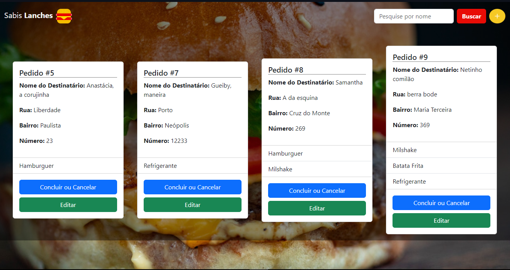
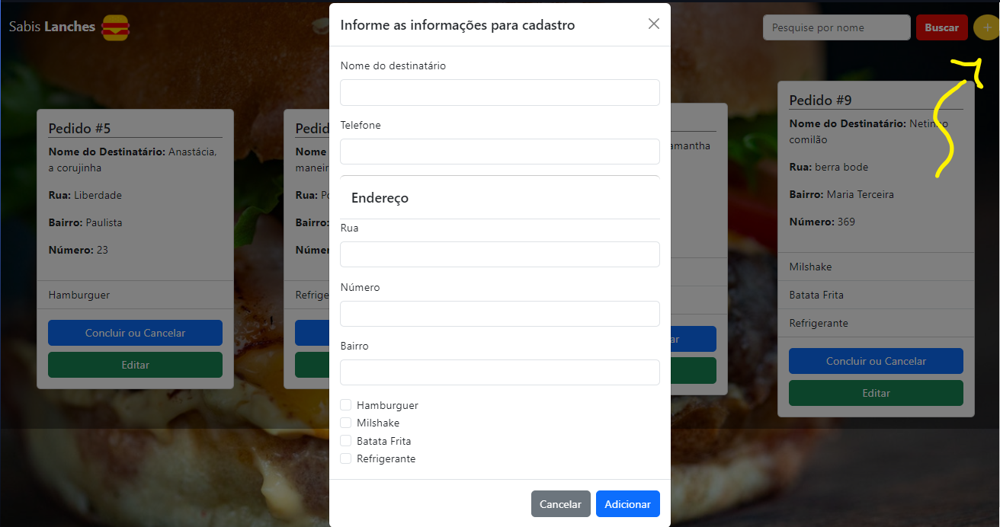
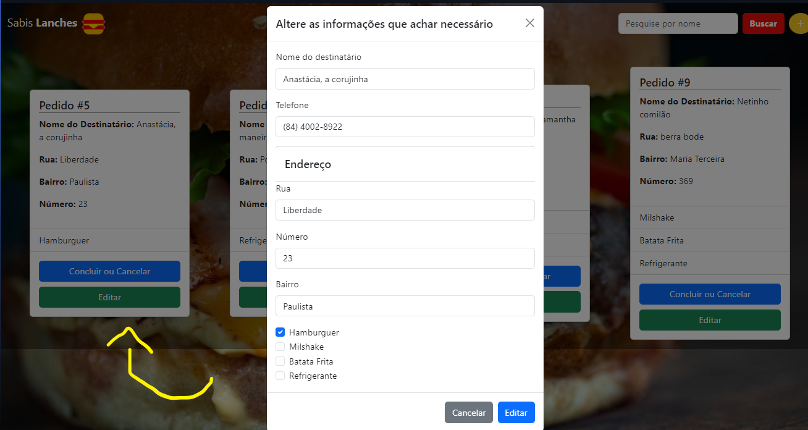
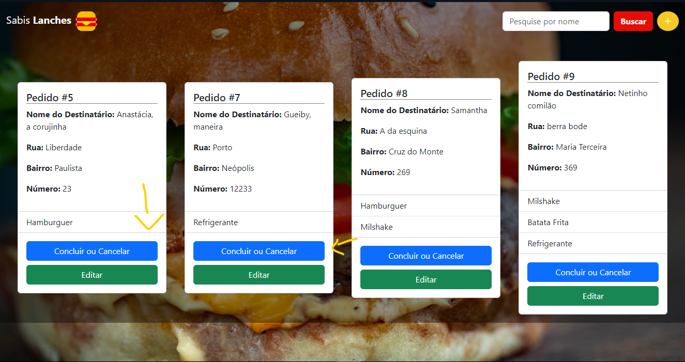

<h1>CRUD Para controle de pedidos de uma Lanchonete Delivery</h1>

Contando com as tecnologias de javascript, html, css e o framework Bootstrap, O sabisLanche é um site que registrar pedidos que estão sendo guardados em uma API. Estão sendo utilizados os verbos de controle como post, put e delete

 
<h2>Funcionalidades</h2>
<h3>Página como um todo</h3>

O site conta com um visual temático de fast Foods e bem fácil de usar

<h3>Cadastro de dados</h3>

Ao clicar no votão redondo, amarelo e com símbolo de adição, o usuário é apresentado ao modal forms de cadastro de pedidos onde irá preencher seu nome, telefone, endereço e quais os produtos deseja pedir

<h3>Edição dos pedidos já registrados</h3>

Ao clicar no botão verde presente dentro do card do pedido, o usuário é apresentado à um forms semelhante ao usado para o cadastro de pedidos, mas este já vem com as informações do pedido registrado. Sendo assim, apenas esperando o usuário registrar uma alteração nessas informações

<h3>Concluir/Deletar pedido</h3>

Para concluir ou deletar um pedido basta clicar no botão azul localizado dentro do card do pedido que ele automaticamente sumirá da página e do registro na API

